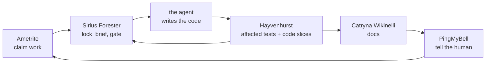

# Sothis — the local-first suite for running a fleet of Claude Code agents

The **Sothis suite** is five local-first developer tools for running a fleet of
AI coding agents against one repository without them tripping over each other.
Sirius Forester is the foreman: it claims work from a local issue tracker, locks
the code each task touches, briefs the agent, and refuses to mark anything done
until the affected tests pass. Hayvenhurst keeps a live code graph so "affected
tests" is a real answer rather than a guess. Ametrite holds the issues and the
knowledge base. Catryna Wikinelli keeps documentation that the code cannot
silently outgrow. PingMyBell rings the human when a decision is needed. Each of
the five stands alone and is useful on its own; together they compose through
shared contracts and plain CLIs. Everything runs on your machine — SQLite
ledgers, git-versioned docs, no cloud, no accounts, and no telemetry. Nothing
leaves your machine.

Built for **Claude Code** and for **AI coding agents** generally. Runs on
**Windows, macOS, Linux**.

<!--
  getsothis.com is registered but does NOT resolve yet (checked 2026-08-24).
  Do NOT link it here until DNS is live and it serves 200 — a canonical or
  prominent link to a dead host is exactly the bug that is currently keeping
  catrynawiki.com out of search indexes (see SF-6). Once it answers, add it
  as the site link here and set it as this repo's homepage field.
-->

## The suite

| Tool | Role | CLI | Repo | Site |
| --- | --- | --- | --- | --- |
| Sirius Forester | foreman / the loop | `sirius` | [Davidb3l/Sirius-Forester](https://github.com/Davidb3l/Sirius-Forester) | [siriusforester.com](https://siriusforester.com) |
| Hayvenhurst | live code graph | `hayven` | [Davidb3l/Hayvenhurst-dev](https://github.com/Davidb3l/Hayvenhurst-dev) | [hayvenhurst.dev](https://hayvenhurst.dev) |
| Ametrite | issues + knowledge base | `amt` | [Davidb3l/Ametrite](https://github.com/Davidb3l/Ametrite) | [ametrite.com](https://ametrite.com) |
| Catryna Wikinelli | living documentation | `catryna` (bun plugin) | [Davidb3l/Catryna-Wikinelli](https://github.com/Davidb3l/Catryna-Wikinelli) | [catrynawiki.com](https://catrynawiki.com) |
| PingMyBell | notifications / the bell | `pingmybell` | [Davidb3l/pingmybell](https://github.com/Davidb3l/pingmybell) | — |

## Install

The install has **two halves, and the order matters**: the Claude Code
**plugins** first, then the **CLIs**. The plugin half is the one that gets
dropped, and a fleet with the CLIs but no plugins looks installed while none of
the slash commands, skills, or the MCP server wiring exist.

### 1. Plugins (do this first)

```bash
claude plugin marketplace add Davidb3l/Sirius-Forester
claude plugin install sirius@sirius-forester
claude plugin install hayvenhurst@sirius-forester
claude plugin install catryna@sirius-forester
```

These commands are non-interactive, so you can also just ask Claude Code to run
them. In the desktop app the same thing is available as **+** → **Plugins** →
**Add plugin**, and in a terminal session as the `/plugin` dialog.

### 2. CLIs — macOS and Linux

With the `sirius` plugin installed, one shot installs every missing suite CLI
via each tool's own verified installer, then re-checks the plugin half:

```bash
"${CLAUDE_PLUGIN_ROOT}/scripts/install-sothis.sh"
```

Or say **"let's Sothis this up"** in Claude Code, or run `/sirius:install-suite`.
Either way it ends with `sirius doctor`, and a half-done install says so loudly
instead of looking finished.

### 3. CLIs — Windows

The Windows tarballs (`*-windows-x64.tar.gz`, with `.sha256` and
`.sigstore.json`) ship on every release, and both entry points below work
today: the POSIX installers detect `MINGW*`/`MSYS*`/`CYGWIN*` and resolve the
`.exe` binaries, and each has a PowerShell sibling for shells with no Git Bash.

**Git Bash** (or WSL, or any POSIX shell on Windows) runs the same script as
macOS and Linux:

```bash
"${CLAUDE_PLUGIN_ROOT}/scripts/install-sothis.sh"
```

**PowerShell** users run the PowerShell sibling:

```powershell
& "$env:CLAUDE_PLUGIN_ROOT\scripts\install-sothis.ps1"
```

Both paths install the same `windows-x64` artifacts, and both verify the
`.sha256` checksum before anything is unpacked. `sirius` additionally verifies
its Sigstore bundle: a bad signature always aborts, and a missing bundle aborts
too — the one soft case is a machine with neither `cosign` nor `sigstore`
installed, where the installer warns and proceeds on TLS plus the checksum.
Pass `--require-signature` (PowerShell: `-RequireSignature`) to make that fatal
as well. `hayven` verifies its checksum only.

## How they fit together

The Sothis suite is a loop, not a framework. Each tool owns one store and talks to
the others only through their CLIs and an **MCP server** where an agent needs
structured access — so any one of them can be swapped, skipped, or run alone.

Ametrite holds the work. Sirius claims one issue at a time, asks Hayvenhurst
which symbols that issue touches, takes a lock on them, and hands the agent a
brief. The agent works. On the way out Sirius asks Hayvenhurst for the tests
affected by the actual diff and gates completion on them passing. Catryna
updates the docs that describe the changed code and flags the ones that drifted.
PingMyBell tells the human when the loop needs a decision or a run is done.



## Why local-first

- **SQLite ledgers.** Claims, locks, receipts, issues, and the code graph live
  in local databases inside the repo you are working on.
- **Git-versioned docs.** Catryna's documentation is MDX in `.docs/`, reviewed
  in the same pull request as the code it describes.
- **No cloud.** Nothing is uploaded, and the tools make no LLM calls of their
  own — the agents bring their own model.
- **No accounts.** No sign-up, no API key, no seat. Install the binaries and go.
- **Readable by hand.** Every store is inspectable with the CLI or with
  `sqlite3`, so you are never locked out of your own history.

## Troubleshooting

### `claude plugin install` fails with `Permission denied (publickey)`

**Symptom.** `claude plugin marketplace add Davidb3l/Sirius-Forester` succeeds,
then the very next command fails — first with `No ED25519 host key is known for
github.com`, and after you add the host keys, with `Permission denied
(publickey)`.

**Cause.** Plugins whose marketplace entry uses a `git-subdir` source are cloned
over SSH. `marketplace add` falls back to HTTPS when SSH is unavailable;
`plugin install` does not. On a machine with no GitHub SSH key — the normal
state of a fresh Windows box — the clone has nothing to authenticate with.

**Fix.** Rewrite the SSH remote to HTTPS for that one command, through git's
environment-variable config so nothing on disk changes:

```bash
GIT_CONFIG_COUNT=1 \
GIT_CONFIG_KEY_0=url.https://github.com/.insteadOf \
GIT_CONFIG_VALUE_0=git@github.com: \
claude plugin install hayvenhurst@sirius-forester
```

```powershell
$env:GIT_CONFIG_COUNT=1; $env:GIT_CONFIG_KEY_0='url.https://github.com/.insteadOf'; $env:GIT_CONFIG_VALUE_0='git@github.com:'
claude plugin install hayvenhurst@sirius-forester
```

Repeat for whichever plugins failed. The installers print this command for you
when they detect the failure; in PowerShell the variables live for the rest of
the session, so drop them again with `Remove-Item Env:GIT_CONFIG_COUNT,
Env:GIT_CONFIG_KEY_0, Env:GIT_CONFIG_VALUE_0` when you are done.

### Installed, but `sirius: command not found`

**Symptom.** The installer reports success and the binary is on disk, but
`sirius`, `hayven`, or `amt` is not found in any shell.

**Cause.** The binaries land in `~/.local/bin` (`%USERPROFILE%\.local\bin`),
which is a Unix convention that nothing on Windows adds to `PATH`. The
installers never mutate your `PATH` for you.

**Fix.** On macOS and Linux, add it to your shell profile:

```bash
export PATH="$HOME/.local/bin:$PATH"   # in ~/.zshrc or ~/.bashrc
```

On Windows, run this **once** in PowerShell to fix `PATH` for every shell,
editor, and the Claude desktop app:

```powershell
[Environment]::SetEnvironmentVariable('Path', [Environment]::GetEnvironmentVariable('Path','User') + ';' + "$env:USERPROFILE\.local\bin", 'User')
```

`install-sothis.ps1 -AddToPath` does the same thing for you. Either way, **PATH
changes only reach new processes** — close and reopen your shells, your editor,
and Claude Code before you retest.

### The installer refuses to run on your platform

**Symptom.** An installer aborts with an unsupported-platform error on Windows,
even from Git Bash.

**Cause.** An old checkout. Earlier installers detected only `Linux` and
`Darwin` from `uname -s` and bailed on the `MINGW*`/`MSYS*`/`CYGWIN*` values
Git Bash reports.

**Fix.** Use the current installers — they resolve the `windows-x64` artifacts
and the `.exe` binaries, and ship a PowerShell sibling for shells with no Git
Bash. Update the plugin (`claude plugin update sirius@sirius-forester`) or
re-fetch the scripts from the repo, then re-run.

## Docs

- Sirius Forester — [siriusforester.com](https://siriusforester.com) ·
  [getting started](https://siriusforester.com/docs/getting-started/)
- Hayvenhurst — [hayvenhurst.dev](https://hayvenhurst.dev)
- Ametrite — [ametrite.com](https://ametrite.com)
- Catryna Wikinelli — [catrynawiki.com](https://catrynawiki.com)
- PingMyBell — [github.com/Davidb3l/pingmybell](https://github.com/Davidb3l/pingmybell)

## License

MIT. See [LICENSE](LICENSE).
